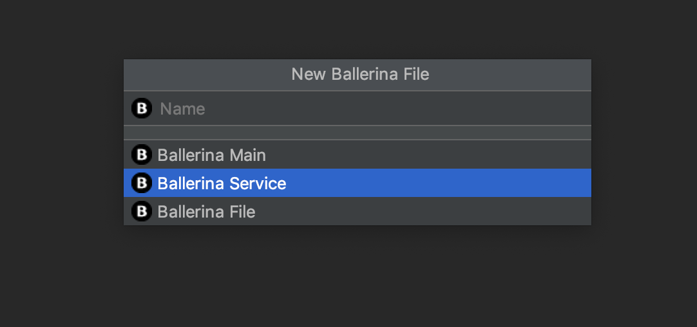

# Ballerina Programming Language


`V 0.991`

[Ballerina](https://v1-0.ballerina.io/) is an open source programming language and platform for cloud-era application programmers to easily write software that just works.

## Prerequisites

* [JDK 8](http://www.oracle.com/technetwork/java/javase/downloads/jdk8-downloads-2133151.html) or [OpenJDK 8](http://openjdk.java.net/install/)
* [Node (v8.9.x) + npm (v5.6.0 or later)](https://nodejs.org/en/download/)
* [Docker](https://www.docker.com/get-docker)
* [Kubernetes](https://kubernetes.io/)
* [Ballerina](https://ballerina.io/learn/getting-started/)

* [VSC](https://v1-0.ballerina.io/learn/tools-ides/vscode-plugin/) or [IntelliJ](https://v1-0.ballerina.io/learn/tools-ides/intellij-plugin/) ([see](https://ballerina.io/learn/tools-ides/intellij-plugin/using-the-intellij-plugin)) Ballerina plugin


## See more

* [Examples](https://ballerina.io/learn/by-example/) 
* [Ballerina central](https://central.ballerina.io/)
* [Publishing config](https://central.ballerina.io/publish-module)


## Todo

### Validation tests (TDD:  [warriors](warriors/api-tests.http) & [apigw](api-gateway/api-tests.http))
When deploy the services on the cluster, verify that the following calls work:
 - should succeed only inside the cluster
```bash
curl GET http://wiarriors-service/api/v1/warriors
```
- Outside the cluster with a valid apikey should succeed
```bash
curl GET http://techwatch.io/api/v1/apigw/warriors -H "apikey: Z2FtZTpnYW1lMQ==" 
```
- Outside the cluster with a invalid apikey should fail
```bash
curl GET http://techwatch.io/api/apigw/v1/warriors -H "apikey: G02TheBeach==" 
```
### [Step 0] Init project

```bash
# use ballerina init command inside the work directory   
ballerina init
``` 
### [Step 1] Warriors service

- Add the service as a ballerina module `New` -> `Module`
 

- Create the service class  `New` -> `New Ballerina File`, 


- [Code the config and logic](warriors/warriors-service.bal) the service
     
### [Step 2] API Gateway
Add the API Gateway service as a ballerina module, 
create the service class 
and [code the config and logic](api-gateway/ApiGateway.bal) of the API Gateway

### [Step 3] Add Kubernetes config

The Kubernetes config of the internal service  (do the same for warriors service)
````ballerina
@kubernetes:Service {
    name: "Warriors"
}
@kubernetes:Deployment {
    image: "warriors",    // remember the docker image should contain only simple letters
    name: "WarriorsService",
    replicas: 3,
    namespace: "wired-services",
    buildImage: false,
    labels: {team:"WIRED", scope:"SERVICE"},
    dockerHost: "tcp://192.168.99.103:2376",    // IP can be obtained via `minikube ip` command
    dockerCertPath: "~/.minikube/certs",    // Docker cert path should be configure here
    singleYAML: true
}
````
To build the docker image, add docker expose config, will build the docker image when run the ballerina build command

````ballerina
@docker:Expose{}
````
### [Step 4] Build project
We need a Kubernetes cluster running, in this example we use [minikube](https://github.com/kubernetes/minikube),
[install](https://kubernetes.io/fr/docs/tasks/tools/install-minikube/) it and start the cluster:
```bash
minikube start
```
- Logs
 
 
And then build the project using command `ballerina build <module>`, 
will build the specified module or all modules if no specifications. 
````bash
ballerina build warriors
````
- Logs:

 
- Generated files: 


- Generated Dockerfile for `api-gateway service`: 


- Generated deployment file for `api-gateway service`: 

 
### [Step 5] Deploy our services
The deployment commands are logged when run ballerina build.

- Docker container
````bash
docker run -d -p 9090:9090 warriors:latest
````
- Kubernetes deployment 
````bash
kubectl apply -f <path-to-your-projec-dir>/target/kubernetes/warriors
````

### [Step 6] Plugin Tools
The current version of the intellij plugin has bugs, the vsc plugin will be used to continue this work.

- The plugin generates sequence diagrams from the source code in real-time


 - The API desiner generates documentation from the source code but also allows the reverse generate a code from the disigner in real time. We can therefore develop services without writing any line of code,only by using the UI

 - 
